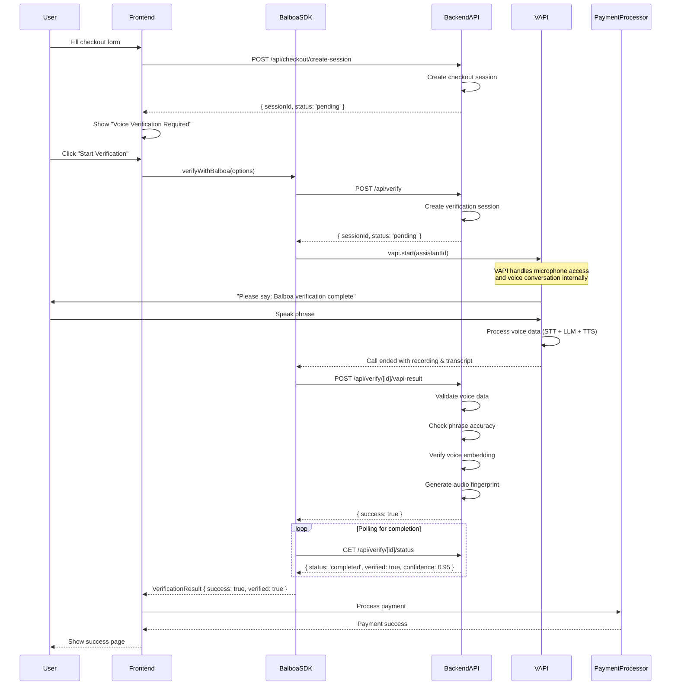

# Balboa Voice Verification SDK: Technical Specification

## Overview

The Balboa SDK provides a simple, "one-function" interface for developers to integrate voice-based multi-factor authentication into any checkout flow. It abstracts away the complexity of session management, voice API interaction, and status polling into a single asynchronous function call.

## Architecture Flow



## Client-Side SDK (`@balboa/sdk`)

### Core Function: `verifyWithBalboa()`

The main entry point for initiating a verification flow. It manages the entire process internally.

**Signature:**
```typescript
verifyWithBalboa(options: VerificationOptions): Promise<VerificationResult>
```

**Parameters (`VerificationOptions` object):**
- `transactionId` (string): A unique identifier for the transaction
- `customerData` (object): Data related to the customer and checkout (e.g., cart items, user info)
- `riskLevel` (number, optional): A pre-calculated fraud risk score to inform the verification logic
- `timeout` (number, optional): Custom timeout in milliseconds (default: 30000)
- `retries` (number, optional): Number of retry attempts (default: 3)

**Return Value (`Promise<VerificationResult>` object):**
- `success` (boolean): `true` if the verification process completed without errors
- `verified` (boolean): `true` if the user's voice was successfully verified
- `confidence` (number): A score from 0.0 to 1.0 indicating the confidence in the verification result
- `sessionId` (string): The unique ID for the verification session
- `details` (object, optional): Additional verification details including phrase accuracy, voice match score, and fingerprint validation

**Error Handling:**
The function will throw a `BalboaError` if the verification process fails, times out, or encounters an API error.

### React Hook: `useBalboa()`

A utility for seamless integration into React applications. It manages loading, result, and error states.

**Signature:**
```typescript
useBalboa(): { verifyWithBalboa, isLoading, result, error }
```

**Returned Object:**
- `verifyWithBalboa`: The core verification function described above
- `isLoading` (boolean): `true` while the verification process is in flight
- `result` (`VerificationResult` | null): The successful result of the verification
- `error` (Error | null): Any error object caught during the process

### Configuration

**BalboaConfig interface:**
```typescript
interface BalboaConfig {
  apiKey: string
  baseUrl: string
  environment?: 'sandbox' | 'production'
  timeout?: number
  retries?: number
}
```

## Internal Verification Flow

The `verifyWithBalboa()` function orchestrates the following sequence:

1. **Start Session:** The SDK makes a `POST` request to the backend `/api/verify` endpoint with the transaction and customer data to create a new verification session.

2. **Initiate Voice Conversation:** The SDK triggers a voice conversation via the VAPI service. VAPI handles all microphone access, speech-to-text, LLM processing, and text-to-speech internally.

3. **Submit Voice Data:** Upon conversation completion, the SDK sends the call results (recording, transcript) to the backend `/api/verify/[sessionId]/vapi-result` endpoint.

4. **Poll for Status:** The SDK begins polling the backend `/api/verify/[sessionId]/status` endpoint to get the final verification outcome.
   - Polling uses an **exponential backoff** strategy to be efficient
   - The process will time out after a maximum of 30 seconds (configurable)

5. **Return Result:** Once the backend returns a status of `completed` or `failed`, the SDK resolves the promise with the final `VerificationResult` or throws an error.

## Required Backend API Endpoints

The SDK requires the host application to implement the following three server-side API endpoints.

### 1. Create Verification Session

**Endpoint:** `POST /api/verify`

**Request Body:**
```json
{
  "transactionId": "string",
  "customerData": "object",
  "riskLevel": "number"
}
```

**Logic:**
- Creates a session record in the database with a `pending` status
- Can optionally perform a fraud assessment. If risk is determined to be very low, it can immediately update the session status to `completed` and bypass the voice call

**Success Response:**
```json
{
  "id": "string", // session.id
  "status": "string" // 'pending' or 'completed'
}
```

### 2. Get Session Status

**Endpoint:** `GET /api/verify/[id]/status`

**Request Body:** None. The session ID is passed in the URL.

**Success Response:**
```json
{
  "status": "string", // 'pending', 'completed', or 'failed'
  "verified": "boolean | null",
  "confidence": "number | null",
  "error": "string | null"
}
```

### 3. Submit VAPI Result

**Endpoint:** `POST /api/verify/[id]/vapi-result`

**Request Body:**
```json
{
  "callId": "string",
  "recording": "string", // URL or base64 data
  "transcript": "string"
}
```

**Logic:**
- Receives voice data from the SDK
- Performs the core voice validation/liveness check
- Updates the session record status to `completed` or `failed` with the final verification result

**Success Response:**
```json
{
  "success": true
}
```

## VAPI Integration

### Assistant Configuration

The SDK uses VAPI to handle voice conversations. The assistant is configured with:

```typescript
const assistantConfig = {
  model: {
    provider: "openai",
    model: "gpt-4",
    systemMessage: `
      You are Balboa, a voice verification assistant.
      Your task:
      1. Greet the user warmly
      2. Ask them to say: "Balboa verification complete"
      3. Confirm you heard them correctly
      4. Thank them and end the call

      Keep it under 30 seconds. Be professional but friendly.
    `
  },
  voice: {
    provider: "elevenlabs",
    voiceId: "rachel"
  },
  transcriber: {
    provider: "deepgram",
    model: "nova-2"
  }
}
```

### What VAPI Handles

✅ **Microphone access and permissions**
✅ **Speech-to-text processing**
✅ **LLM conversation management**
✅ **Text-to-speech generation**
✅ **Call lifecycle management**
✅ **Real-time audio processing**

### What We Handle

✅ **Assistant configuration**
✅ **Call result processing**
✅ **Backend voice validation**
✅ **Session management**
✅ **Error handling and retries**

## Error Handling

### Common Error Scenarios

1. **Microphone Access Denied**
   - Error: `BalboaError("Microphone access required")`
   - Solution: Prompt user to enable microphone permissions

2. **Voice Verification Failed**
   - Error: `VerificationResult { success: true, verified: false }`
   - Solution: Allow user to retry verification

3. **Network Timeout**
   - Error: `BalboaError("Verification timeout")`
   - Solution: Retry with exponential backoff

4. **API Errors**
   - Error: `BalboaError("API error: [details]")`
   - Solution: Check API key and network connectivity

### Retry Strategy

The SDK implements automatic retries with exponential backoff:
- Initial retry after 1 second
- Subsequent retries with 1.5x multiplier
- Maximum retry delay of 5 seconds
- Configurable retry count (default: 3)

## Usage Examples

### Basic Integration

```typescript
import { BalboaClient } from '@balboa/sdk'

const client = new BalboaClient({
  apiKey: process.env.BALBOA_API_KEY,
  baseUrl: process.env.BALBOA_API_URL
})

const result = await client.verifyWithBalboa({
  transactionId: 'txn_123',
  customerData: { email: 'user@example.com' },
  riskLevel: 75
})

if (result.success && result.verified) {
  // Proceed with payment
  await processPayment()
}
```

### React Integration

```typescript
import { useBalboa } from '@balboa/sdk'

function CheckoutComponent() {
  const { verifyWithBalboa, isLoading, result, error } = useBalboa()

  const handleVerification = async () => {
    try {
      const result = await verifyWithBalboa({
        transactionId: generateTransactionId(),
        customerData: checkoutData
      })

      if (result.success && result.verified) {
        await processPayment()
      }
    } catch (error) {
      console.error('Verification failed:', error)
    }
  }

  return (
    <button onClick={handleVerification} disabled={isLoading}>
      {isLoading ? 'Verifying...' : 'Start Verification'}
    </button>
  )
}
```

## Security Considerations

1. **API Key Management**: Store API keys securely, never expose them in client-side code
2. **Session Security**: Use secure session IDs and implement proper session validation
3. **Voice Data Privacy**: Ensure voice recordings are encrypted in transit and at rest
4. **Rate Limiting**: Implement rate limiting to prevent abuse
5. **Audit Logging**: Log all verification attempts for security monitoring

## Performance Considerations

1. **Polling Optimization**: Uses exponential backoff to minimize API calls
2. **Timeout Management**: Configurable timeouts prevent hanging requests
3. **Error Recovery**: Automatic retries with intelligent backoff
4. **Bundle Size**: Minimal SDK footprint with tree-shaking support

## Browser Compatibility

- **Modern Browsers**: Chrome 80+, Firefox 75+, Safari 13+, Edge 80+
- **Mobile Support**: iOS Safari 13+, Chrome Mobile 80+
- **WebRTC Required**: For VAPI voice functionality
- **HTTPS Required**: For microphone access in production

## Package Structure

```
packages/balboa-sdk/
├── src/
│   ├── index.ts              # Main SDK entry point
│   ├── client.ts             # Core BalboaClient class
│   ├── vapi-integration.ts   # VAPI integration logic
│   ├── types.ts              # TypeScript definitions
│   ├── errors.ts             # Error handling
│   └── hooks/
│       └── useBalboa.ts      # React hook
├── dist/                     # Built bundles
├── package.json
└── tsconfig.json
```

## Build Configuration

The SDK is built with:
- **TypeScript** for type safety
- **Rollup** for bundling
- **ESBuild** for fast builds
- **Multiple formats**: ESM, CJS, UMD
- **Tree shaking** support
- **Source maps** for debugging

## Testing Strategy

1. **Unit Tests**: Core SDK functionality
2. **Integration Tests**: API endpoint interactions
3. **E2E Tests**: Full verification flow
4. **Mock Testing**: VAPI integration mocking
5. **Error Scenarios**: Comprehensive error handling tests
